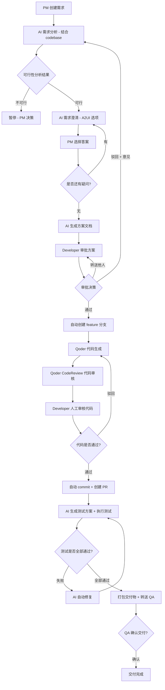
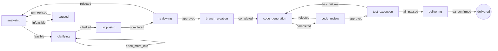
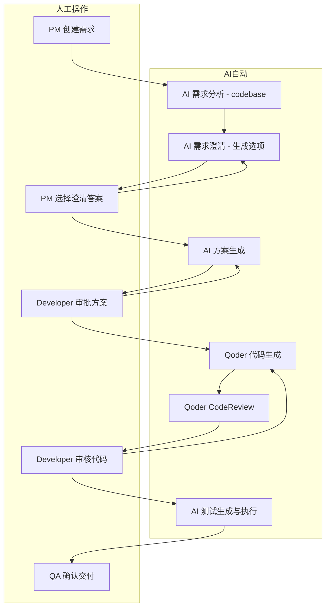
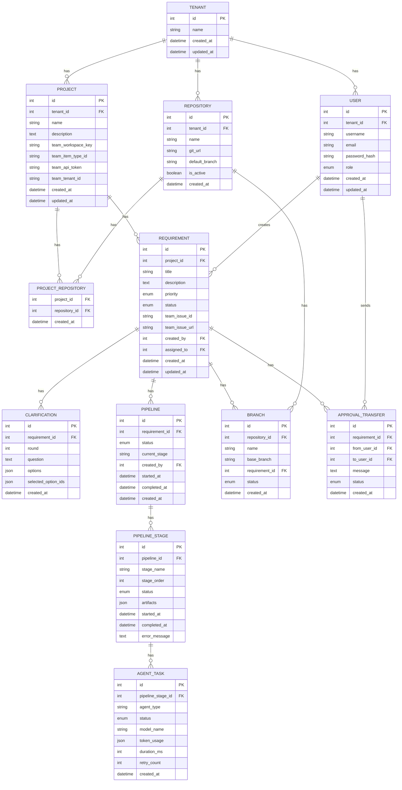

# Dagent 产品需求文档（PRD）

> **版本**: v2.1  
> **最后更新**: 2026-07-24  
> **状态**: 待评审  
> **变更说明**: 基于 v2.0 修订——整合 Team API 文档、Git 集成改为 CLI 命令方式、需求同步标记为自动行为

---

## 目录

1. [项目概述](#1-项目概述)
2. [用户角色与权限](#2-用户角色与权限)
3. [核心概念：多租户与项目空间](#3-核心概念多租户与项目空间)
4. [功能模块详细描述](#4-功能模块详细描述)
5. [页面设计说明](#5-页面设计说明)
6. [业务流程图](#6-业务流程图)
7. [数据模型概览](#7-数据模型概览)
8. [技术架构概览](#8-技术架构概览)
9. [外部系统集成](#9-外部系统集成)（Team API + Git CLI + AI 模型）
10. [非功能性需求](#10-非功能性需求)（含 10.5 前端演示模式）
11. [分阶段交付计划](#11-分阶段交付计划)
12. [风险与依赖](#12-风险与依赖)
13. [开放问题](#13-开放问题)

---

## 1. 项目概述

### 1.1 项目基本信息

| 项 | 内容 |
|----|------|
| **项目名称** | Dagent — AI 驱动的研发自动化平台 |
| **项目定位** | 覆盖从需求提交到 QA 交付前全流程的 AI 研发自动化工作台 |
| **愿景** | 让研发团队专注于创造性工作，将重复性的需求分析、方案编写、代码生成、测试执行交由 AI Agent 自动完成 |

### 1.2 核心痛点

| # | 痛点 | 现状 |
|---|------|------|
| P1 | **需求到代码的人工环节多** | 从产品提需求到最终交付，需经过多轮人工沟通、手动编写方案、手动编码、手动测试，流程冗长 |
| P2 | **重复劳动占比高** | 大量时间花在需求澄清、方案文档编写、单元测试编写等可被 AI 辅助的工作上 |
| P3 | **AI 能力未充分利用** | 团队已使用 LLM 工具，但仅限于零散的对话式辅助，未形成系统化的 AI 驱动工作流 |
| P4 | **流程不透明** | 需求流转到哪个阶段、谁在处理、产出物是什么，缺乏统一可视化视图 |

### 1.3 核心价值主张

1. **端到端自动化**：从需求描述到可测试代码，AI Agent 自动驱动全流程，人工仅在关键节点审核
2. **智能需求分析**：AI 结合项目 codebase 自动分析可行性，识别技术风险，减少沟通成本
3. **人机协作模式**：AI 做重活（分析、生成），人做决策（审核、澄清），确保质量与效率兼得
4. **全流程可追溯**：每个阶段的输入输出完整记录，审计友好、复盘有据

---

## 2. 用户角色与权限

### 2.1 角色定义

#### 产品经理（PM）

**职责**：需求的发起者和最终确认者，负责提交需求、回答 AI 澄清问题、审核技术方案、确认提测交付。

**典型场景**：
- 在系统中创建新需求，描述功能目标和验收标准
- 通过选项卡方式回答 AI 提出的澄清问题
- 审核 AI 生成的技术方案文档，可补充编辑
- 确认提测交付包完整后完成交付

#### 开发工程师（Developer）

**职责**：技术层面的把关者，负责审核方案和代码、手动补充或修正方案与代码、查看测试结果。

**典型场景**：
- 审核 AI 生成的技术方案，可编辑补充方案文档
- 将方案审批转送给其他同事确认
- 审核 AI 生成的代码 diff，逐文件确认
- 查看自动测试报告，定位失败用例

#### QA 工程师（QA）

**职责**：质量保障的最终接收方，接收提测交付并查看测试方案与报告。

**典型场景**：
- 接收系统推送的提测交付包（含测试方案文档）
- 查看自动化测试报告（通过率、覆盖率、失败日志）
- 确认交付物完整性后开始手工测试

#### 管理员（Admin）

**职责**：平台管理者，负责项目空间配置、第三方集成对接、用户权限管理。

**典型场景**：
- 创建和管理项目空间，绑定代码仓库
- **配置代码托管平台集成参数（Team API Token、Git 仓库 URL 等）**
- 管理用户账号和角色分配
- 查看系统运行状态和日志

### 2.2 权限矩阵

| 操作 | PM | Developer | QA | Admin |
|------|:--:|:---------:|:--:|:-----:|
| 创建需求 | ✅ | ❌ | ❌ | ❌ |
| 查看需求列表/详情 | ✅ | ✅ | ✅ | ✅ |
| 回答 AI 澄清问题 | ✅ | ❌ | ❌ | ❌ |
| 审核/编辑方案文档 | ❌ | ✅ | ❌ | ❌ |
| 转送方案审批 | ❌ | ✅ | ❌ | ❌ |
| 审核代码变更 | ❌ | ✅ | ❌ | ❌ |
| 查看测试报告 | ✅ | ✅ | ✅ | ✅ |
| 确认提测交付 | ✅ | ❌ | ✅ | ❌ |
| 创建项目空间 | ❌ | ❌ | ❌ | ✅ |
| 管理项目空间配置 | ❌ | ❌ | ❌ | ✅ |
| 管理用户/权限 | ❌ | ❌ | ❌ | ✅ |
| 配置集成 | ❌ | ❌ | ❌ | ✅ |

### 2.3 认证方式

- **协议**：JWT（JSON Web Token）
- **算法**：HS256
- **Token 有效期**：24 小时（可配置）
- **登录方式**：用户名 + 密码
- **Token 传递**：HTTP Header `Authorization: Bearer <token>`
- **前端存储**：localStorage，路由守卫校验

---

## 3. 核心概念：多租户与项目空间

### 3.1 多租户设计

Dagent 是一个多租户系统。每个租户（组织/团队）拥有独立的数据空间，不同租户之间的数据完全隔离。

- **租户（Tenant）**：代表一个组织或团队，是系统的顶层隔离单元
- 每个用户归属于一个租户，只能看到自己所属租户下的数据
- 租户由管理员创建和配置

### 3.2 项目空间

**项目空间（Project）** 是租户下的轻量级组织单元，用于绑定代码仓库，为 AI Agent 提供 codebase 上下文。

| 特性 | 说明 |
|------|------|
| **定位** | 代码仓库的逻辑容器，不是项目管理系统 |
| **核心能力** | 绑定一个或多个代码仓库，AI Agent 基于这些仓库的 codebase 进行需求分析和代码生成 |
| **不包含** | 成员管理、任务看板、迭代管理等项目管理功能 |
| **与需求的关系** | 每个需求归属于一个项目空间，AI 分析时自动关联该项目空间下绑定的仓库 |

### 3.3 数据隔离层级

```
Tenant（租户）
 └── Project（项目空间）
      ├── Repository（绑定的代码仓库）
      ├── Requirement（需求）
      │    └── Pipeline（自动化流水线）
      └── ...
```

---

## 4. 功能模块详细描述

### 4.1 项目空间管理

#### 4.1.1 功能概述

管理员创建和管理项目空间，为项目空间绑定代码仓库。项目空间是需求运行的上下文环境，AI Agent 基于项目空间绑定的仓库进行 codebase 分析。

#### 4.1.2 用户故事

| # | 用户故事 |
|---|---------|
| US-P.1 | As an **Admin**, I want to **创建项目空间并填写基本信息**, so that **为后续需求提供仓库上下文** |
| US-P.2 | As an **Admin**, I want to **在项目空间中绑定/解绑代码仓库**, so that **AI 分析时可以访问正确的代码库** |
| US-P.3 | As an **any role**, I want to **查看项目空间列表及其绑定的仓库**, so that **了解当前可用的项目环境** |

#### 4.1.3 项目空间数据

| 字段 | 类型 | 必填 | 说明 |
|------|------|:----:|------|
| `id` | int | 自动 | 主键 |
| `tenant_id` | int | 自动 | 所属租户 |
| `name` | string | ✅ | 项目空间名称 |
| `description` | text | 选填 | 项目描述 |
| `team_workspace_key` | string | 选填 | Team 系统工作空间 key（用于同步需求） |
| `team_item_type_id` | string | 选填 | Team 事项类型 objectId（如“需求”类型） |
| `team_api_token` | string | 选填 | Team API Token（X-Proxima-API-Token） |
| `team_tenant_id` | string | 选填 | Team 租户标识（X-Parse-Application-Id） |
| `created_at` | datetime | 自动 | 创建时间 |
| `updated_at` | datetime | 自动 | 更新时间 |

> **说明**：Team 相关配置用于需求自动同步。配置后，该项目空间下创建的需求将自动同步到 Team 系统对应的 workspace。

#### 4.1.4 项目-仓库关联

| 字段 | 类型 | 说明 |
|------|------|------|
| `project_id` | int | 项目空间 ID（FK） |
| `repository_id` | int | 仓库 ID（FK） |

#### 4.1.5 API 端点

| Method | Path | 说明 |
|--------|------|------|
| POST | `/api/v1/projects` | 创建项目空间 |
| GET | `/api/v1/projects` | 项目空间列表 |
| GET | `/api/v1/projects/{id}` | 项目空间详情（含仓库列表） |
| PUT | `/api/v1/projects/{id}` | 更新项目空间 |
| DELETE | `/api/v1/projects/{id}` | 删除项目空间 |
| POST | `/api/v1/projects/{id}/repositories` | 绑定仓库到项目空间 |
| DELETE | `/api/v1/projects/{id}/repositories/{repo_id}` | 解绑仓库 |

---

### 4.2 需求管理

#### 4.2.1 功能概述

需求是 Dagent 平台的核心起点。需求在项目空间下创建，创建后自动触发 AI 驱动的端到端流水线。需求与其对应的研发流程（流水线）整合在一起，在需求详情页直接展示完整的流程进度。

**重要变更**：
- 需求与流水线合并，不再有独立的流水线模块
- 需求在平台上创建，**自动同步到 Team 系统**（无需用户手动触发，不是从 Team 导入）
- 侧边栏导航不再有独立的“流水线”入口
- 需求列表页没有“同步到 Team”按钮，因为同步是创建时的自动行为

#### 4.2.2 用户故事

| # | 用户故事 |
|---|---------|
| US-1.1 | As a **PM**, I want to **在项目空间下手动创建需求并填写 Markdown 描述**, so that **我可以快速录入新需求** |
| US-1.2 | As a **PM**, I want to **需求创建时自动同步到 Team 系统（无需手动操作）**, so that **Team 系统中自动有对应记录** |
| US-1.3 | As a **PM**, I want to **按状态/优先级/创建人筛选需求**, so that **快速找到我关注的需求** |
| US-1.4 | As a **any role**, I want to **在需求详情页直接查看流水线进度**, so that **了解需求的完整处理流程** |
| US-1.5 | As a **any role**, I want to **分页浏览需求列表**, so that **高效浏览大量需求** |

#### 4.2.3 数据字段

| 字段 | 类型 | 必填 | 说明 |
|------|------|:----:|------|
| `id` | int | 自动 | 主键 |
| `project_id` | int | ✅ | 所属项目空间（FK） |
| `title` | string | ✅ | 需求标题，最长 200 字符 |
| `description` | text | ✅ | 需求描述，支持 Markdown |
| `priority` | enum | ✅ | 优先级：P0（紧急）、P1（高）、P2（中）、P3（低） |
| `status` | enum | 自动 | 需求状态，见状态流转 |
| `team_issue_id` | string | 自动 | 同步到 Team 系统后返回的 Issue ID |
| `team_issue_url` | string | 自动 | Team 系统 Issue 链接 |
| `created_by` | int | 自动 | 创建人 ID |
| `assigned_to` | int | 选填 | 指派人 ID |
| `created_at` | datetime | 自动 | 创建时间 |
| `updated_at` | datetime | 自动 | 更新时间 |

#### 4.2.4 需求状态流转

```
draft → analyzing → clarifying → clarified → proposing → reviewing → ready → coding → testing → delivering → delivered
```

| 状态 | 中文含义 | 触发条件 |
|------|---------|---------|
| `draft` | 草稿 | 需求刚创建，尚未提交 |
| `analyzing` | 需求分析中 | AI 正在结合 codebase 分析可行性 |
| `clarifying` | 澄清中 | AI 通过选项方式向用户澄清模糊点 |
| `clarified` | 已澄清 | 用户完成澄清，AI 确认无遗留问题 |
| `proposing` | 方案生成中 | AI 正在生成技术方案文档 |
| `reviewing` | 方案审批中 | 等待人工审批方案 |
| `ready` | 就绪 | 方案审批通过，自动创建分支并开始编码 |
| `coding` | 编码中 | 流水线进入代码生成与审核阶段 |
| `testing` | 测试中 | 流水线进入自动测试阶段 |
| `delivering` | 提测中 | 等待 QA 确认交付 |
| `delivered` | 已交付 | 提测交付完成 |

#### 4.2.5 API 端点

| Method | Path | 说明 |
|--------|------|------|
| POST | `/api/v1/requirements` | 创建需求（自动触发流水线 + 自动同步到 Team） |
| GET | `/api/v1/requirements` | 需求列表（分页、筛选、排序） |
| GET | `/api/v1/requirements/{id}` | 需求详情（含流水线进度） |
| PUT | `/api/v1/requirements/{id}` | 更新需求 |

> **说明**：需求创建时系统自动调用 Team API（`POST /forge/api/v2/items`）同步到 Team 系统，无需用户手动触发。

---

### 4.3 需求分析（全新）

#### 4.3.1 功能概述

需求提交后，AI Agent 结合项目空间绑定的代码仓库（codebase）分析需求可行性。通过 Agent 调用 Skill 分析项目下的代码仓库，输出可行性报告。

#### 4.3.2 用户故事

| # | 用户故事 |
|---|---------|
| US-2.1 | As a **PM**, I want to **需求提交后 AI 自动分析可行性**, so that **快速了解技术层面的可行性** |
| US-2.2 | As a **PM**, I want to **查看可行性报告（可行/不可行 + 分析理由）**, so that **做出是否继续的决策** |

#### 4.3.3 分析过程

1. 需求提交后，系统自动触发需求分析阶段
2. AI Agent 调用 Skill 读取项目空间绑定的代码仓库
3. 分析代码结构、现有架构、相关模块
4. 输出可行性报告

#### 4.3.4 可行性报告格式

```json
{
  "report_id": "FA-20260724-001",
  "requirement_id": 42,
  "analyzed_at": "2026-07-24T10:30:00Z",
  "feasibility": "feasible",
  "summary": "基于现有代码架构分析，该需求技术上可行",
  "analysis": [
    {
      "aspect": "架构兼容性",
      "result": "compatible",
      "detail": "现有模块化架构支持新增该功能，无需大规模重构"
    },
    {
      "aspect": "影响范围",
      "result": "moderate",
      "detail": "预计影响 3 个模块：user_service, auth_middleware, api_router"
    },
    {
      "aspect": "技术风险",
      "result": "low",
      "detail": "无明显技术风险"
    }
  ],
  "repositories_analyzed": ["repo-frontend", "repo-backend"]
}
```

#### 4.3.5 分析结果处理

| 结果 | 处理 |
|------|------|
| **可行（feasible）** | 自动进入需求澄清阶段 |
| **不可行（infeasible）** | 暂停流水线，通知 PM 查看报告并决策（修改需求或放弃） |

---

### 4.4 需求澄清（全新交互方式）

#### 4.4.1 功能概述

如果需求分析中发现模糊或需要澄清的地方，AI 不是让用户自由文本输入，而是通过**选项框（A2UI）** 方式给用户选择。每个澄清点是一个选择题，AI 生成 2-4 个选项，用户点选即可。

#### 4.4.2 用户故事

| # | 用户故事 |
|---|---------|
| US-3.1 | As a **PM**, I want to **通过选择题方式回答 AI 的澄清问题**, so that **快速高效地完成需求澄清** |
| US-3.2 | As a **PM**, I want to **每个澄清点看到 AI 推荐的选项**, so that **减少思考成本** |

#### 4.4.3 澄清交互设计

每个澄清点的数据结构：

```json
{
  "clarification_id": "CL-001",
  "question": "用户认证方式需要支持哪些？",
  "options": [
    { "id": "opt-1", "label": "仅用户名+密码", "description": "最基础的认证方式" },
    { "id": "opt-2", "label": "用户名+密码 + OAuth2", "description": "支持第三方登录" },
    { "id": "opt-3", "label": "用户名+密码 + OAuth2 + SSO", "description": "企业级单点登录" }
  ],
  "allow_multiple": true,
  "ai_recommendation": "opt-2",
  "selected": null
}
```

#### 4.4.4 澄清流程

1. AI 分析需求后生成澄清问题列表（每个问题附带 2-4 个选项）
2. PM 在需求详情页看到澄清面板，每个问题以选择题形式展示
3. PM 点选每个问题的答案（支持单选/多选）
4. 全部选择完成后点击"提交澄清"
5. AI 基于选择结果更新需求理解，如有更多问题则生成新一轮澄清
6. 无遗留问题 → 需求状态变为 `clarified`

#### 4.4.5 澄清记录数据

| 字段 | 类型 | 说明 |
|------|------|------|
| `id` | int | 主键 |
| `requirement_id` | int | 关联需求 |
| `round` | int | 第几轮澄清 |
| `question` | text | AI 提出的问题 |
| `options` | json | 选项列表 |
| `selected_option_ids` | json | 用户选择的选项 ID 列表 |
| `created_at` | datetime | 创建时间 |

---

### 4.5 方案生成

#### 4.5.1 功能概述

需求澄清完成后，AI Agent 基于澄清后的需求和 codebase 分析结果自动生成技术方案文档。方案支持 Markdown、Mermaid 等常用格式。

#### 4.5.2 用户故事

| # | 用户故事 |
|---|---------|
| US-4.1 | As a **Developer**, I want to **查看 AI 生成的技术方案文档**, so that **快速了解实现方案** |
| US-4.2 | As a **Developer**, I want to **方案中包含架构图（Mermaid）和接口定义**, so that **全面评估方案** |

#### 4.5.3 方案文档结构

```markdown
# 技术方案：{需求标题}

## 1. 背景与目标
## 2. 架构设计（含 Mermaid 架构图）
## 3. 接口定义（API Design）
## 4. 影响范围评估
## 5. 涉及的代码仓库
## 6. 风险与注意事项
## 7. 测试策略建议
```

---

### 4.6 方案审批（重大调整）

#### 4.6.1 功能概述

方案生成后进入人工审批阶段。审批人（Developer）可以：通过审批、编辑补充方案、转送给其他人确认。AI 预选涉及的仓库，人工可以修改。审批失败时，人工给出意见后流程**回到需求分析阶段从头再来**。

#### 4.6.2 用户故事

| # | 用户故事 |
|---|---------|
| US-5.1 | As a **Developer**, I want to **审批方案（通过/驳回）**, so that **确保方案质量** |
| US-5.2 | As a **Developer**, I want to **在线编辑补充方案文档**, so that **完善 AI 生成的方案** |
| US-5.3 | As a **Developer**, I want to **将方案转送给其他同事确认**, so that **让更合适的人做审批决策** |
| US-5.4 | As a **Developer**, I want to **修改 AI 预选的仓库列表**, so that **确保代码变更在正确的仓库中** |
| US-5.5 | As a **Developer**, I want to **驳回方案时给出意见，流程从头重来**, so that **AI 能基于更充分的信息重新分析** |

#### 4.6.3 审批流程

| 步骤 | 操作者 | 动作 |
|------|--------|------|
| 1 | AI Agent | 生成方案文档草稿，预选涉及的仓库 |
| 2 | Developer | 审阅方案，可在线编辑补充 |
| 3 | Developer | 调整仓库选择（增删仓库） |
| 4a | Developer | **通过** → 自动创建分支，进入编码阶段 |
| 4b | Developer | **转送** → 指定另一位同事继续审批 |
| 4c | Developer | **驳回** → 填写意见/指令 → 流程**回到需求分析阶段从头再来** |

#### 4.6.4 转送审批数据

| 字段 | 类型 | 说明 |
|------|------|------|
| `id` | int | 主键 |
| `requirement_id` | int | 关联需求 |
| `from_user_id` | int | 转送人 |
| `to_user_id` | int | 被转送人 |
| `message` | text | 转送说明 |
| `status` | enum | `pending` / `accepted` / `rejected` |
| `created_at` | datetime | 创建时间 |

#### 4.6.5 仓库预选

- AI 在方案生成阶段自动预选需要变更的仓库（基于 codebase 分析）
- 预选结果展示在审批页面中，Developer 可以增删修改
- 最终确认的仓库列表用于后续分支创建和代码生成

---

### 4.7 创建分支

#### 4.7.1 功能概述

方案审批通过后，系统自动在确认的仓库中创建 feature 分支。分支自动命名，无需人工干预。

#### 4.7.2 分支命名规则

```
feature/REQ-{requirement_id}-{slug}
```

示例：`feature/REQ-42-user-auth-refactor`

- `requirement_id`：关联的需求 ID
- `slug`：基于需求标题自动生成的英文短标识（取前 5 个单词，kebab-case）

#### 4.7.3 分支数据

| 字段 | 类型 | 说明 |
|------|------|------|
| `id` | int | 主键 |
| `repository_id` | int | 关联仓库（FK） |
| `name` | string | 分支名称 |
| `base_branch` | string | 基于哪个分支创建 |
| `requirement_id` | int | 关联需求（FK） |
| `status` | enum | `active` / `merged` / `closed` |

---

### 4.8 代码生成（明确工具链）

#### 4.8.1 功能概述

分支创建完成后，系统调用 **Qoder（OpenCode）+ Skills** 进行代码生成。不是自研 Agent，而是集成现有的编码 Agent 能力。AI 基于审批通过的方案文档和仓库现有代码，自动生成代码变更。

#### 4.8.2 用户故事

| # | 用户故事 |
|---|---------|
| US-6.1 | As a **Developer**, I want to **查看 AI 生成的代码变更（diff 视图）**, so that **快速理解每处改动** |
| US-6.2 | As a **Developer**, I want to **审核通过后自动 commit + 创建 PR**, so that **无需手动操作 Git** |

#### 4.8.3 代码生成工具链

| 组件 | 用途 |
|------|------|
| **Qoder（OpenCode）** | 编码 Agent，基于方案文档 + codebase 上下文生成代码 |
| **Skills** | 特定领域的技能包，指导 Agent 遵循项目代码规范和架构模式 |

#### 4.8.4 代码生成流程

1. 系统将方案文档 + 确认的仓库列表 + 分支信息发送给 Qoder
2. Qoder 调用 Skills 分析现有代码，生成代码变更
3. 变更以 diff 形式展示给 Developer
4. Developer 审核通过后，自动 commit 到 feature 分支并创建 PR

---

### 4.9 代码审核（明确工具链）

#### 4.9.1 功能概述

代码生成完成后，系统调用 **Qoder CodeReview + Skills** 进行自动化代码审核，然后交由 Developer 做最终人工审核。

#### 4.9.2 审核流程

1. AI 代码生成完成 → 系统自动调用 Qoder CodeReview
2. Qoder CodeReview 输出审核报告（代码质量、潜在问题、建议）
3. 审核报告与 diff 一起展示给 Developer
4. Developer 做最终人工审核：
   - **通过** → 自动 commit + 创建 PR
   - **驳回** → 填写理由 → 重新调用 Qoder 生成代码

#### 4.9.3 代码审核工具链

| 组件 | 用途 |
|------|------|
| **Qoder CodeReview** | 自动代码审核 Agent，检查代码质量、安全性、规范性 |
| **Skills** | 项目特定的审核规则（如命名规范、架构约束） |

---

### 4.10 测试执行

#### 4.10.1 功能概述

代码审核通过后，AI 自动生成单元测试并在沙箱环境中执行。**需要保留测试方案文档**，不只是执行测试，还要输出完整的测试方案。

#### 4.10.2 用户故事

| # | 用户故事 |
|---|---------|
| US-7.1 | As a **Developer**, I want to **AI 自动生成测试用例并执行**, so that **减少手动编写测试的时间** |
| US-7.2 | As a **Developer**, I want to **查看测试方案和测试报告**, so that **全面了解测试覆盖情况** |
| US-7.3 | As a **Developer**, I want to **测试失败时 AI 自动修复**, so that **加速测试通过周期** |

#### 4.10.3 测试方案文档

AI 生成的测试方案文档作为该阶段的产出物持久保存，包含：

```markdown
# 测试方案：{需求标题}

## 1. 测试范围
## 2. 测试策略（单元测试为主）
## 3. 测试用例列表
## 4. 预期结果与验收标准
```

#### 4.10.4 测试报告结构

```json
{
  "report_id": "TEST-20260724-001",
  "requirement_id": 42,
  "executed_at": "2026-07-24T14:00:00Z",
  "duration_seconds": 120,
  "summary": {
    "total": 45,
    "passed": 42,
    "failed": 2,
    "skipped": 1,
    "pass_rate": "93.3%",
    "coverage": "78.5%"
  },
  "failed_cases": [
    {
      "name": "test_user_login_with_expired_token",
      "error": "AssertionError: expected 401 but got 200",
      "traceback": "...",
      "ai_fix_attempted": true,
      "ai_fix_success": false
    }
  ]
}
```

#### 4.10.5 测试修复循环

1. AI 生成测试代码 + 执行业务代码
2. 在沙箱环境中运行测试
3. 生成测试报告
4. 若存在失败用例：AI 分析失败原因 → 自动修复（最多重试 3 次）→ 重新执行
5. 3 次修复后仍有失败 → 标记为需人工介入，流水线暂停
6. 全部通过 → 进入提测交付阶段

---

### 4.11 提测交付

#### 4.11.1 功能概述

所有测试通过后，AI 生成测试方案文档，系统将交付包**转送给 QA 测试同事**。需要 QA 做最终确认后才算交付完成，不是自动完成。

#### 4.11.2 用户故事

| # | 用户故事 |
|---|---------|
| US-8.1 | As a **PM**, I want to **查看完整的交付包**, so that **确认所有产出物齐全** |
| US-8.2 | As a **QA**, I want to **接收转送的提测交付包和测试方案**, so that **高效开始手工测试** |
| US-8.3 | As a **QA**, I want to **确认交付后才算完成**, so that **确保交付质量** |

#### 4.11.3 交付包内容

| 产出物 | 说明 |
|--------|------|
| 需求文档 | 原始需求描述 + 澄清记录 |
| 方案文档 | 审核通过的技术方案 |
| 代码变更 | 完整的 diff + PR 链接 |
| 测试方案文档 | AI 生成的测试方案（持久保存） |
| 测试报告 | 自动化测试结果、覆盖率、日志 |

#### 4.11.4 交付流程

1. 测试全部通过 → 系统自动打包交付物
2. 系统推送通知给 QA（转送交付）
3. PM 确认需求覆盖度
4. QA 确认交付包完整性
5. QA 确认 → 需求状态变为 `delivered`
6. 系统自动同步更新 Team 系统 Issue 状态

---

### 4.12 仓库管理

#### 4.12.1 功能概述

管理员在系统中注册代码仓库（通过 Git URL 配置），仓库可被绑定到项目空间中。实际 Git 操作通过 **git CLI 命令行**（Python subprocess 调用）完成，不依赖任何 Git 平台的 REST API。

#### 4.12.2 仓库数据

| 字段 | 类型 | 说明 |
|------|------|------|
| `id` | int | 主键 |
| `tenant_id` | int | 所属租户（FK） |
| `name` | string | 仓库名称 |
| `git_url` | string | 仓库 Git URL（clone 地址） |
| `default_branch` | string | 默认分支（如 `main`） |
| `is_active` | boolean | 是否启用 |
| `created_at` | datetime | 创建时间 |

#### 4.12.3 Git CLI 命令层

所有 Git 操作通过 Python subprocess 调用 git 命令行完成，不依赖 Gitee 或任何代码托管平台的 REST API：

| 操作 | Git 命令 | 说明 |
|------|---------|------|
| 克隆仓库 | `git clone {git_url}` | 拉取仓库到本地工作目录 |
| 创建分支 | `git checkout -b feature/REQ-{id}-{name}` | 基于当前分支创建 feature 分支 |
| 推送分支 | `git push origin feature/REQ-{id}-{name}` | 将本地分支推送到远程 |
| 提交变更 | `git add . && git commit -m "{message}"` | 提交代码变更 |
| 查看变更 | `git diff` / `git log` | 查看代码 diff 和提交历史 |
| 合并分支 | `git merge {branch}` | 合并分支 |
| 拉取更新 | `git pull origin {branch}` | 拉取远程更新 |

> **重要**：不使用 Gitee API 适配器（如 GitAdapter 类），所有仓库操作均通过 git CLI 完成。认证通过 Git URL 中内嵌的凭证或 SSH Key 实现。

---

## 5. 页面设计说明

### 5.1 登录页（`/login`）

**布局**：页面居中显示登录卡片，整体简洁大方。

| 元素 | 说明 |
|------|------|
| Logo + 标题 | "Dagent" 品牌标识 |
| 用户名输入框 | `text` 类型，placeholder "请输入用户名" |
| 密码输入框 | `password` 类型，placeholder "请输入密码" |
| 登录按钮 | 主色调按钮，点击后调用 `/api/v1/auth/login` |
| 错误提示 | 登录失败时在表单上方显示错误消息 |

**交互**：
- 登录成功后将 token 存入 localStorage，跳转至 Dashboard
- 未登录访问任何页面自动重定向到登录页

### 5.2 Dashboard 看板（`/`）

**布局**：顶部统计卡片 + 下方双栏列表。

| 区域 | 内容 |
|------|------|
| **统计卡片**（4 个） | ① 需求总数 ② 进行中需求 ③ 今日完成数 ④ 待审批数 |
| **最近需求**（左栏） | 最新 5 条需求，显示标题、状态标签、优先级标签、创建时间 |
| **活跃流程**（右栏） | 最新 5 条进行中的需求流程，显示需求标题、当前阶段、状态（颜色标识） |

### 5.3 需求列表页（`/requirements`）

**布局**：顶部操作栏 + 筛选器 + 数据表格 + 分页。

| 元素 | 说明 |
|------|------|
| **操作栏** | "创建需求" 按钮 + 项目空间选择下拉框 |
| **筛选器** | 状态下拉（多选）、优先级下拉（多选）、创建人下拉 |
| **表格列** | 标题（可点击跳转详情）、优先级（P0 红 / P1 橙 / P2 蓝 / P3 灰）、状态（彩色标签）、当前阶段、创建人、创建时间 |
| **分页** | 默认每页 20 条，支持切换 |

**变更**：去掉“从 Team 导入”按钮；去掉“同步到 Team”按钮（同步是创建时的自动行为）。

### 5.4 需求详情页（`/requirements/:id`）— 核心页面

**布局**：顶部需求基本信息 + 流程进度条 + 下方阶段内容区。

| 区域 | 内容 |
|------|------|
| **顶部 — 需求信息** | 标题、优先级、状态、创建人 + Markdown 渲染的需求描述 |
| **流程进度条** | 水平步骤条，展示完整流程阶段。已完成 ✓（绿色）、进行中 ●（蓝色脉动）、等待审核 ⚠（橙色）、待处理 ○（灰色） |
| **阶段内容区** | 根据当前阶段动态展示对应面板（见下方） |

**流程进度条阶段**：

| # | 阶段 | 对应状态 |
|---|------|---------|
| 1 | 需求分析 | `analyzing` |
| 2 | 需求澄清 | `clarifying` |
| 3 | 方案生成 | `proposing` |
| 4 | 方案审批 | `reviewing` |
| 5 | 创建分支 | `ready` |
| 6 | 代码生成 | `coding` |
| 7 | 代码审核 | `coding` |
| 8 | 测试执行 | `testing` |
| 9 | 提测交付 | `delivering` |

**各阶段面板内容**：

| 阶段 | 面板内容 |
|------|---------|
| 需求分析 | 可行性报告展示（可行/不可行 + 分析详情） |
| 需求澄清 | 选择题形式的澄清问题列表（A2UI 选项框交互） |
| 方案生成 | Markdown 渲染的方案文档（只读） |
| 方案审批 | 方案文档（可编辑）+ 仓库预选列表（可修改）+ 通过/驳回/转送按钮 |
| 代码生成 | 代码 diff 视图 + Agent 实时日志 |
| 代码审核 | CodeReview 报告 + diff 视图 + 通过/驳回按钮 |
| 测试执行 | 测试方案文档 + 测试报告（通过率、覆盖率）+ Agent 日志 |
| 提测交付 | 交付包清单 + 确认交付按钮（QA 可见） |

### 5.5 项目空间管理页（`/projects`）

**布局**：项目列表 + 项目详情面板。

| 元素 | 说明 |
|------|------|
| **操作按钮** | "创建项目空间" 按钮（弹窗表单：名称、描述） |
| **项目列表** | 名称、描述、绑定仓库数量、创建时间、操作 |
| **项目详情** | 点击项目后展开：绑定的仓库列表（可添加/移除仓库） |

### 5.6 仓库管理页（`/repositories`）

**布局**：顶部操作 + 仓库列表。

| 元素 | 说明 |
|------|------|
| **操作按钮** | "注册仓库" 按钮（弹窗表单：仓库名称、Git URL、默认分支） |
| **仓库表格** | 名称、Git 链接、默认分支、状态（启用/禁用）、操作 |

**变更**：仓库注册后需在项目空间中绑定才能被 AI 使用。

### 5.7 侧边栏导航结构

```
├── Dashboard（看板）
├── 需求（Requirements）    ← 核心入口，包含流程进度
├── 项目空间（Projects）
├── 仓库（Repositories）
└── 设置（Settings）        ← 系统配置
```

**重要变更**：不再有独立的"流水线（Pipelines）"导航入口。

---

## 6. 业务流程图

### 6.1 需求到交付完整流程



### 6.2 Pipeline 状态机



### 6.3 人机协作节点




---

## 7. 数据模型概览

### 7.1 ER 关系图



### 7.2 核心表简述

| 表名 | 说明 |
|------|------|
| `tenants` | 租户表，系统顶层隔离单元 |
| `user` | 用户表，存储用户基本信息和角色，归属租户 |
| `project` | 项目空间表，轻量级仓库容器，归属租户 |
| `project_repository` | 项目-仓库关联表，多对多关系 |
| `repository` | 仓库表，注册管理的代码仓库，归属租户 |
| `requirement` | 需求表，平台核心实体，归属项目空间 |
| `clarification` | 澄清记录表，记录 A2UI 选项式澄清历史 |
| `approval_transfer` | 方案审批转送记录表 |
| `branch` | 分支表，跟踪 feature 分支生命周期 |
| `pipeline` | 流水线表，关联需求的自动化流程实例 |
| `pipeline_stage` | 流水线阶段表，记录每个阶段的执行状态和产出物 |
| `agent_task` | Agent 任务表，记录每次 AI Agent 的执行详情 |

### 7.3 数据模型变更说明（对比 v1.1）

| 变更类型 | 说明 |
|---------|------|
| **新增** `tenants` 表 | 多租户设计，顶层隔离 |
| **新增** `project` 表 | 项目空间表，轻量级仓库容器，含 Team 系统配置字段，归属租户 |
| **新增** `project_repository` 表 | 项目与仓库多对多关联 |
| **新增** `approval_transfer` 表 | 方案审批转送功能 |
| **修改** `user` 表 | 新增 `tenant_id` FK |
| **修改** `repository` 表 | 新增 `tenant_id` FK，`gitee_url` 改为通用 `git_url`，不使用 Gitee API 适配器 |
| **修改** `requirement` 表 | 新增 `project_id` FK，去掉导入方向说明 |
| **修改** `clarification` 表 | 改为 A2UI 选项模式（新增 `round`, `options`, `selected_option_ids`） |
| **修改** `pipeline_stage` 表 | 新增 `artifacts` 字段存储阶段产出物 |
| **移除** `proposal` 表 | 方案文档作为 pipeline 阶段的产出物（artifacts），不再独立建表 |

---

## 8. 技术架构概览

### 8.1 技术栈

| 层 | 技术选型 |
|----|---------|
| **前端** | Vue 3 + TypeScript + Vite + Vue Router + Pinia + Element Plus |
| **后端** | Python + FastAPI + SQLAlchemy + Pydantic |
| **数据库** | MySQL（aiomysql 异步驱动） |
| **缓存** | Redis |
| **LLM** | DeepSeek Chat（默认，可切换） |
| **代码生成** | Qoder（OpenCode）+ Skills |
| **代码审核** | Qoder CodeReview + Skills |
| **代码托管** | 通过 Git CLI 命令行操作（git clone/checkout/push 等） |
| **认证** | JWT（HS256） |

### 8.2 系统架构

```
┌─────────────────────────────────────────────────┐
│                   前端 (Vue 3)                    │
│  登录 │ Dashboard │ 需求 │ 项目空间 │ 仓库        │
└──────────────────────┬──────────────────────────┘
                       │ HTTP/REST API
┌──────────────────────┴──────────────────────────┐
│                后端 (FastAPI)                      │
│  ┌─────────┐ ┌──────────┐ ┌──────────────────┐  │
│  │ API 层   │ │ Service  │ │ Agent 编排层      │  │
│  │ (v1)    │ │ 层       │ │ (BaseAgent)      │  │
│  └────┬────┘ └────┬─────┘ └────────┬─────────┘  │
│       │           │                │              │
│  ┌────┴───────────┴────────────────┴─────────┐   │
│  │          Pipeline State Machine            │   │
│  └────────────────────┬──────────────────────┘   │
└───────────────────────┼─────────────────────────┘
                        │
        ┌───────────────┼───────────────┐
        │               │               │
   ┌────┴────┐   ┌──────┴────┐  ┌──────┴────────┐
   │ MySQL   │   │ Redis     │  │ 集成层         │
   │ 数据库   │   │ 缓存      │  │ Team REST API │
   │         │   │           │  │ + Git CLI      │
   └─────────┘   └───────────┘  │ + Qoder API    │
                                 └───────────────┘
```

### 8.3 集成架构

平台集成的外部系统及其对接方式：

| 外部系统 | 对接方式 | 说明 |
|---------|---------|------|
| **Team 系统** | REST API（HTTP 调用，`X-Proxima-API-Token` 认证） | 需求同步、状态流转、评论、工作流等 |
| **Git 仓库** | Git CLI 命令（Python subprocess） | clone、checkout、branch、commit、push、diff 等 |
| **编码 Agent** | Qoder（OpenCode）API + Skills | 代码生成与审核 |

> **架构变更**：不再使用 `GitAdapter` 适配器模式对接 Gitee API，改为直接调用 git CLI 命令。Team 系统通过 REST API 集成，认证方式为 Header Token。

### 8.4 多租户数据隔离

- 所有核心数据表（project, repository, requirement 等）均包含 `tenant_id` 字段
- API 层通过中间件自动注入当前用户的 `tenant_id`，确保数据隔离
- 查询接口默认过滤 `WHERE tenant_id = :current_tenant_id`

---

## 9. 外部系统集成

### 9.1 集成概览

Dagent 平台需要与以下外部系统集成：

| 系统 | 对接方式 | 认证方式 | 系统地址 |
|------|---------|---------|----------|
| **Team 系统（Eova）** | REST API（HTTP 调用） | `X-Proxima-API-Token` + `X-Parse-Application-Id` | `https://forge-dev.eova.cn/` |
| **Git 仓库** | Git CLI 命令（Python subprocess） | SSH Key 或 URL 凭证 | 配置的 Git URL |
| **AI 模型（Qoder）** | API 调用 | API Token | Qoder/OpenCode 服务 |

### 9.2 Team API 认证

所有 Team API 请求需携带以下 Header：

```
Headers:
  Content-Type: application/json
  X-Proxima-API-Token: {token}         # API Token 认证
  X-Parse-Application-Id: {tenant}     # 租户标识
```

- **API Base URL**：`https://forge-dev.eova.cn/`
- **Token 来源**：由 Team 系统管理员分配，存储在 Dagent 的项目空间配置中
- **租户标识（tenant）**：通过 `X-Parse-Application-Id` 传递，对应 Dagent 的租户

### 9.3 Team API 接口明细

以下为 Dagent 各阶段使用的 Team API 接口：

| dagent 阶段 | Team API | 方法 | 说明 |
|---|---|---|---|
| 需求创建→同步 | `POST /forge/api/v2/items` | POST | 创建事项，需指定 workspace 和 itemType |
| 需求状态流转 | `POST /forge/functions/transition` | POST | 流转事项状态，需 workflowId、currentState、transition、itemId |
| 获取可用流转 | `GET /forge/workflows/available-transitions?item={itemId}` | GET | 获取当前可流转的动作列表 |
| 获取工作流 | `GET /forge/api/workflows/item/{itemId}` | GET | 获取事项的工作流详情（节点和流转规则） |
| 查询需求列表 | `POST /forge/api/search` | POST | IQL 查询事项，支持分页和字段筛选 |
| 获取需求详情 | `GET /forge/api/items/{itemId}` | GET | 获取事项详情，含字段、状态、评论等 |
| 编辑需求 | `PUT /forge/api/v2/items/{objectId}` | PUT | 更新事项字段值 |
| 澄清评论 | `POST /forge/classes/Comment` | POST | 创建评论记录澄清过程 |
| 获取评论 | `GET /forge/api/items/{itemId}/comments` | GET | 获取事项的评论历史 |
| 获取空间列表 | `GET /forge/api/workspaces` | GET | 获取可用空间（对应项目空间绑定） |
| 获取用户列表 | `POST /forge/classes/_User` | POST | 查询用户（用于转送审核等） |
| 设置负责人 | `PUT /forge/api/v2/items/{objectId}` | PUT | 通过 assignee 字段设置 |
| 关注人管理 | `POST/GET/DELETE /forge/api/items/{itemKey}/watchers` | 多 | 管理事项关注人 |
| 文件上传 | `POST /forge/api/file/upload` | POST | 上传附件到事项 |
| 获取版本 | `GET /forge/api/versions` | GET | 获取版本清单 |
| 获取迭代 | `POST /forge/classes/Sprint` | POST | 获取迭代列表 |

### 9.4 工作流状态映射

Dagent 的 9 阶段流水线需要映射到 Team 的工作流状态：

- 每个项目空间需配置对应的 Team 空间（workspace）和事项类型（itemType）
- Dagent 的阶段变更时，调用 `POST /forge/functions/transition` API 同步状态到 Team
- 工作流获取：`POST /forge/api/workflows/workspace/itemType` 可获取空间内某类型的工作流

**状态同步流程**：

1. Dagent 流水线阶段变更时，查询 Team 事项的可用流转（`GET /forge/workflows/available-transitions`）
2. 找到匹配的 transition 后，调用 `POST /forge/functions/transition` 执行流转
3. 同步失败时记录日志，不阻塞 Dagent 内部流程

### 9.5 关键数据模型

Team API 中使用的关键数据格式：

#### Pointer 类型

Team API 中使用 Pointer 引用其他对象：

```json
{
  "__type": "Pointer",
  "className": "Workspace",
  "objectId": "xxx"
}
```

#### 创建事项请求示例

```json
{
  "name": "用户认证重构",
  "workspace": {
    "__type": "Pointer",
    "className": "Workspace",
    "objectId": "ws-123"
  },
  "itemType": {
    "__type": "Pointer",
    "className": "ItemType",
    "objectId": "it-456"
  },
  "values": {
    "priority": "P1",
    "description": "重构用户认证模块..."
  }
}
```

#### 关键概念映射

| Team 概念 | Dagent 概念 | 说明 |
|-----------|-----------|------|
| Workspace | 项目空间 | Team 的工作空间对应 Dagent 的项目空间 |
| ItemType | — | 事项类型（如“需求”、“Bug”、“测试”等） |
| Item | Requirement | Team 的事项对应 Dagent 的需求 |
| Tenant（`X-Parse-Application-Id`） | Tenant | 租户标识 |
| Sprint | — | 迭代，可用于关联需求批次 |
| Workflow | Pipeline 状态机 | Team 的工作流节点对应 Dagent 的流水线阶段 |

### 9.6 Git CLI 集成

所有 Git 操作通过 Python subprocess 调用 git 命令行完成，不依赖任何 Git 平台的 REST API。

**Git 认证方式**：
- SSH Key：推荐方式，配置 SSH 密钥访问仓库
- HTTPS + 凭证：在 Git URL 中内嵌凭证或使用 credential helper

**工作目录管理**：
- 每个仓库在工作目录下维护一份 clone
- 分支操作在本地 clone 中完成，然后 push 到远程

### 9.7 AI 模型集成

通过 Qoder（OpenCode）API 集成 AI 能力：

| 组件 | 用途 | 集成方式 |
|------|------|----------|
| Qoder（OpenCode） | 编码 Agent | API 调用 + Skills |
| Qoder CodeReview | 代码审核 | API 调用 + Skills |
| LLM（DeepSeek 等） | 需求分析、方案生成、测试生成 | API 调用 |

---

## 10. 非功能性需求

### 10.1 性能

| 指标 | 要求 |
|------|------|
| API 响应时间 | 常规接口 < 500ms（P95） |
| Agent 任务超时 | 单次 Agent 执行最长 1 小时 |
| 并发用户 | 支持 50 并发用户 |
| 数据库查询 | 单表查询 < 100ms，关联查询 < 300ms |

### 10.2 安全

| 措施 | 说明 |
|------|------|
| JWT 认证 | 所有 API 需携带有效 Token |
| RBAC 权限 | 基于角色的接口级权限控制 |
| 租户隔离 | 数据层面强制 tenant_id 过滤，防止跨租户访问 |
| 密码加密 | bcrypt 哈希存储，禁止明文 |
| 敏感数据 | API Key、Token 等配置通过环境变量注入，不入代码库 |
| CORS | 配置允许的跨域来源 |

### 10.3 可用性

| 策略 | 说明 |
|------|------|
| AI 降级 | AI Agent 执行失败时，标记为需人工处理，不阻塞整体流程 |
| 重试机制 | Agent 任务失败可自动重试（最多 3 次） |
| 手动兜底 | 任何阶段均支持人工接管，确保流程不卡死 |
| 健康检查 | `/health` 端点用于监控系统探活 |

### 10.4 可扩展性

| 设计 | 说明 |
|------|------|
| 插件化 Agent | 基于 `BaseAgent` 抽象类，新增 Agent 只需实现 `agent_type` 和 `execute` 方法 |
| Git CLI | Git 操作通过 CLI 命令完成，不绑定特定代码托管平台 |
| 配置化 | 核心配置（LLM 模型、超时时间、Team API 等）通过环境变量管理，无需改代码 |

### 10.5 前端演示模式（Demo Mode）

#### 10.5.1 设计理念

前端演示模式允许在后端 API 尚未完成的情况下，通过本地 Mock 数据完整展示所有页面的交互效果。适用于**投资人演示、团队评审、产品设计验证**。

核心原则：
- **零后端依赖**：演示模式下无需启动后端服务、数据库、Redis 等任何基础设施
- **全页面可交互**：所有按钮、表单、筛选、分页、状态切换均可正常操作
- **数据一致性**：Mock 数据在页面间保持一致
- **无缝切换**：演示模式与正式 API 模式可通过环境变量一键切换

#### 10.5.2 Mock 数据策略

| 策略 | 说明 |
|------|------|
| **本地 JSON 文件** | 在 `src/mock/` 目录下维护结构化 JSON 数据 |
| **Pinia Store 封装** | Store 层根据 `VITE_DEMO_MODE` 环境变量决定读取 Mock 或 API |
| **数据关联** | Mock 数据中各实体通过 ID 关联，保证跨页面一致性 |
| **状态模拟** | 覆盖所有状态值，确保状态标签、筛选等完整展示 |

#### 10.5.3 演示模式覆盖的页面

| # | 页面 | Mock 数据要点 |
|---|------|-------------|
| 1 | 登录页 | 任意用户名密码可登录 |
| 2 | Dashboard 看板 | 4 个统计卡片 + 最近需求 + 活跃流程 |
| 3 | 需求列表页 | 10+ 条需求数据（覆盖 P0-P3、全部状态）、筛选和分页 |
| 4 | 需求详情页 | 完整流程进度 + 各阶段面板内容（含 A2UI 澄清选项） |
| 5 | 项目空间管理页 | 2-3 个项目空间 + 绑定仓库 |
| 6 | 仓库管理页 | 3-4 个仓库 |

#### 10.5.4 环境切换

| 变量 | 值 | 行为 |
|------|-----|------|
| `VITE_DEMO_MODE` | `true` | 使用本地 Mock 数据，无需后端 |
| `VITE_DEMO_MODE` | `false`（默认） | 调用真实 API |
| `VITE_API_BASE_URL` | 后端地址 | 正式模式下的 API 地址 |

---

## 11. 分阶段交付计划

### Phase 0：项目脚手架（1 周）

| 任务 | 说明 |
|------|------|
| 后端项目初始化 | FastAPI 项目结构、配置管理、数据库连接、CORS |
| 前端项目初始化 | Vue 3 + Vite + TypeScript + Element Plus + 路由 + 状态管理 |
| 基础框架搭建 | 通用响应格式、分页模型、认证中间件、租户隔离中间件 |
| 开发环境配置 | Makefile、docker-compose（MySQL + Redis）、.env |

### Phase 0.5：前端演示模式（1-2 周）

| 任务 | 说明 |
|------|------|
| Mock 数据设计 | 设计覆盖全业务流程的 Mock 数据（含多租户、项目空间、需求流程） |
| Pinia Store 改造 | 所有 Store 支持 Demo 模式 |
| 登录 + Dashboard | 登录页可交互 + Dashboard 统计卡片 + 最近列表 |
| 需求列表 + 详情 | 需求列表（筛选/分页）+ 详情页（流程进度条 + 各阶段面板） |
| 项目空间 + 仓库 | 项目空间管理页 + 仓库管理页 |
| **交付标准** | 所有页面可通过 Mock 数据完整交互，无需后端即可独立演示 |

### Phase 1：多租户 + 项目空间 + 需求管理（2-3 周）

| 任务 | 说明 |
|------|------|
| 多租户基础 | tenants 表、租户隔离中间件、用户-租户关联 |
| 项目空间 CRUD | 创建/列表/详情/更新/删除 + 仓库绑定 |
| 仓库管理 | 仓库注册、列表、Git CLI 对接 |
| 用户认证 | 登录/登出、JWT 签发与校验、角色权限 |
| 需求 CRUD | 创建、列表、详情、更新 API + 前端页面 |
| Team 同步 | 需求创建时自动调用 Team API 同步，无需手动操作 |

### Phase 2：需求分析 + 需求澄清（2 周）

| 任务 | 说明 |
|------|------|
| 需求分析 Agent | 结合 codebase 分析可行性（Agent 调用 Skill 读取仓库） |
| 可行性报告 | 报告生成与展示 |
| A2UI 澄清系统 | 选择题式澄清交互（生成选项 + 用户选择 + 多轮澄清） |
| 前端 | 需求详情页 — 分析面板 + 澄清面板 |

### Phase 3：方案生成 + 方案审批（2 周）

| 任务 | 说明 |
|------|------|
| 方案生成 Agent | 基于澄清后需求 + codebase 生成 Markdown 方案（含 Mermaid 图） |
| 方案审批 | 审批流程（通过/驳回/转送）+ 在线编辑补充 |
| 仓库预选 | AI 预选仓库 + 人工调整 |
| 驳回重启 | 驳回后流程回到需求分析 |
| 前端 | 方案审批面板（编辑 + 仓库选择 + 转送 + 通过/驳回） |

### Phase 4：代码生成 + 代码审核（3 周）

| 任务 | 说明 |
|------|------|
| 分支管理 | 自动创建 feature 分支（git CLI）、自动命名 |
| Qoder 集成 | CodingAgentAdapter 实现，调用 Qoder + Skills 生成代码 |
| Qoder CodeReview 集成 | ReviewAgentAdapter 实现，自动代码审核 |
| 代码 diff 展示 | 前端 diff 视图 + 审核流程 |
| Git 操作 | 自动 commit + push（通过 git CLI） |

### Phase 5：测试 + 提测交付（2 周）

| 任务 | 说明 |
|------|------|
| 测试方案生成 | AI 生成测试方案文档 |
| 测试执行 | 自动生成单元测试 + 沙箱执行 + 测试报告 |
| 自动修复 | 测试失败后 AI 修复 + 重试 |
| 提测交付 | 交付包打包 + 转送 QA + 确认流程 |
| 前端 | 测试报告展示 + 交付确认面板 |

### Phase 6：打磨优化（3 周）

| 任务 | 说明 |
|------|------|
| Dashboard | 统计看板、数据聚合 |
| 流程可视化 | 进度条、实时日志、阶段状态 |
| Agent 日志 | Agent 执行详情、Token 用量统计 |
| 性能优化 | 查询优化、缓存策略、前端懒加载 |
| 错误处理 | 全局异常处理、友好错误提示 |
| 测试 | 后端单元测试、前端 E2E 测试 |

---

## 12. 风险与依赖

### 12.1 技术风险

| # | 风险 | 影响 | 缓解措施 |
|---|------|------|---------|
| R1 | **LLM 输出质量不稳定** | AI 生成的方案/代码可能不符合预期 | 人工审核兜底 + Prompt 工程优化 + 多模型备选 |
| R2 | **Qoder 集成复杂度** | 编码 Agent 调用可能存在兼容性问题 | 充分测试 + 降级方案（人工编码兜底） |
| R3 | **沙箱安全性** | 执行 AI 生成的测试代码可能有安全风险 | Docker 容器隔离 + 资源限制 + 超时控制 |
| R4 | **LLM Token 成本** | 大量需求处理可能导致 Token 消耗过高 | Token 用量监控 + 缓存相似请求 + 模型分级使用 |
| R5 | **多租户数据泄露** | 租户隔离失效导致数据泄露 | 强制 tenant_id 过滤 + 定期安全审计 |

### 12.2 外部依赖

| # | 依赖项 | 状态 | 说明 |
|---|--------|------|------|
| D1 | Team 系统 API | **已整合** | API 文档已整合到 PRD 第 9 章，系统地址：`https://forge-dev.eova.cn/` |
| D2 | ~~Gitee API 权限~~ | **已取消** | 不再使用 Gitee API，改为 Git CLI 命令方式 |
| D3 | Qoder API 接入 | **待确认** | 需确认 Qoder 的 API 接口和调用方式 |
| D4 | LLM 模型选型确定 | **待定** | 需确认使用 DeepSeek / GPT-4 / Claude |
| D5 | 部署环境确定 | **待定** | 需确认部署方式（自建服务器 / 云服务） |

---

## 13. 开放问题

| # | 问题 | 备选方案 | 决策状态 |
|---|------|---------|---------|
| Q1 | LLM 模型选择 | DeepSeek Chat（默认）/ GPT-4o / Claude | 待定 |
| Q2 | 部署方式 | 自建服务器 / 阿里云 / AWS | 待定 |
| Q3 | 与现有 CI/CD 的集成方式 | 独立沙箱测试 / 接入 Jenkins/GitHub Actions | 待定 |
| Q4 | A2UI 澄清选项上限 | 每题 2-4 个选项 / 可扩展 | 暂定 4 个 |
| Q5 | 需求模板 | 自由格式 / 提供结构化模板 | 待定 |
| Q6 | 国际化 | 仅中文 / 中英双语 | 待定（MVP 先中文） |
| Q7 | 项目空间是否支持成员管理 | 暂不支持 / 未来可扩展 | MVP 不支持 |

---

> **文档结束** — 如有疑问或建议，请在评审会议中提出。
